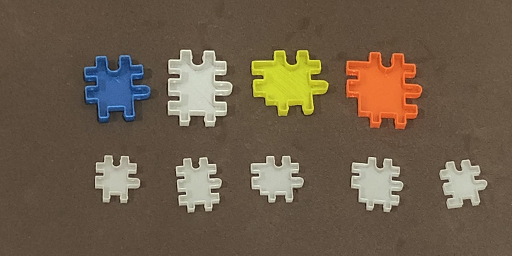
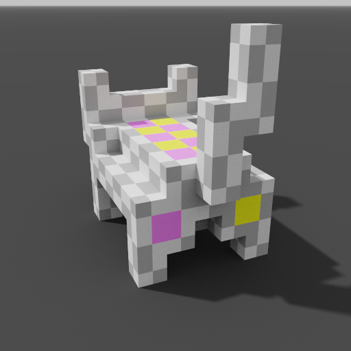

# ChIPs - Polycube/Voxel Construction Set

## [GPGT] No more SNOT. You will only need 4 types of bricks

| polycube/voxel | ChIPs |
| --- | --- |
|  |  |

## tl;dr
Have you wanted to use a construction set to build a model, but don't want to deal with complicated techniques to remove studs / build sideways? Not Square? Too many different types of bricks? Something you can freely 3D print cheaply? etc. Look no further, this is the construction set for you!

## Introduction
ChIPs (Choonway's Interlocking Panels) is an open source (CC-BY 4.0) construction set system that uses interlocking finger joints between panels orientated at 0 degrees or 90 degrees with respect to each other. The resulting object has smooth surfaces on all faces, sharp edges and results in a close physical manifestation of polycube puzzles / voxel art.

On the left is the 37.5mm cube variant with panels colored by type. On the right is the featured cat model using 25mm cube variant with sharp corners. The dimension of the cube variant refers to the length of the side of the unit cube.

Only 4 unique panels (Blue, White, Yellow and Orange) are required for building any model. The 5th panel is optional for sharp corners. Note the sharpness of the ears between the 2 models.

## Guided Build Tutorial

At first glance it might seem confusing which panels to join together to make the object, but not to worry, there is an easy way to figure it with the use of [Ephtracy's MagicaVoxel](https://ephtracy.github.io/).

I call this the 'bubblebath' technique. vox files available [here](vox/cat_tut.vox)

Here we start off with a cat voxel shape, with one voxel per unit cube.
Click on 'Fit Model Size' and take note of the bounding box size X = (5, 9, 8) of the original model

Create the unit bubble (3D checkerboard on a 2x2x2 volume)

Double the size of the bubble and cat

Expand the bubble using the formula below

floor(X/2)+1 = (3, 5, 5)

Grid lines shown for clarity.
Move the cat into the bubble, align with right face,

and take one step into the bubble.

Repeat for front and top faces
In effect we are intermeshing the bubbles a half cube step with the cat model.

In the World View,
Click on the bubbles, then the boolean 'operand', the bubbles should disappear.
Click on the cat model, then click on the boolean 'replace', a pattern should appear on the cat.

Examine the patterns on the frazzled cat. They should match one of the 12 fragments. vox files available [here](vox/cat_frag.vox)

| fragment | ChIPs build youtube video | example locations on cat |
| --- | --- | --- |
| 1 | [0:04](https://www.youtube.com/watch?v=te_LA7-NAmI&t=4s) |  |
| 2 | [0:22](https://www.youtube.com/watch?v=te_LA7-NAmI&t=22s) |  |
| 3 | [0:44](https://www.youtube.com/watch?v=te_LA7-NAmI&t=44s) |  |
| 4 | [1:14](https://www.youtube.com/watch?v=te_LA7-NAmI&t=74s) |  |
| 5 | [1:54](https://www.youtube.com/watch?v=te_LA7-NAmI&t=114s) |  |
| 6 | [2:25](https://www.youtube.com/watch?v=te_LA7-NAmI&t=145s) |  |
| 7 | [2:56](https://www.youtube.com/watch?v=te_LA7-NAmI&t=176s) |  |
| 8 | [3:31](https://www.youtube.com/watch?v=te_LA7-NAmI&t=211s) |  |
| 9 | [4:29](https://www.youtube.com/watch?v=te_LA7-NAmI&t=269s) |  |
| 10 | [5:14](https://www.youtube.com/watch?v=te_LA7-NAmI&t=314s) |  |
| 11 | [6:00](https://www.youtube.com/watch?v=te_LA7-NAmI&t=360s) |  |
| 12 | [6:53](https://www.youtube.com/watch?v=te_LA7-NAmI&t=413s) |  |

Fragments 11 and 12 are not used by the cat model. They can be tricky to identify especially if visibility on the opposite diagonal end is limited and be mistaken for Fragments 2 or 4.

Join all the fragments together and you have your cat.

It is possible, with enough practice, to build some intuition about the fragment/panels required that you can do all of this without external aids.

## Tiny Table

A full build of a tiny table on youtube. vox files available [here](vox/table.vox)

## Manufacturing

WIP

## Resources

See the following websites for more information:

https://www.thingiverse.com/thing:5376746

https://www.printables.com/model/192718-chips-polycube-construction-set

https://www.youtube.com/channel/UC7Iy1mVaFCpzOD8v4n6sJXQ

Copyright 2022 by Liao Choon Way

License: CC BY 4.0
